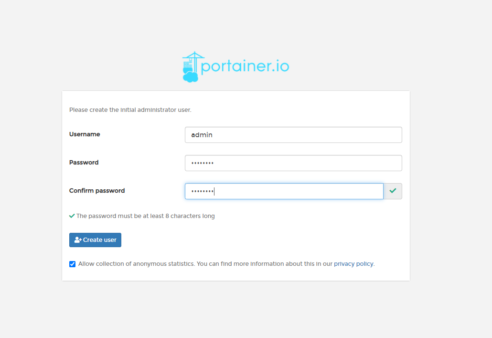
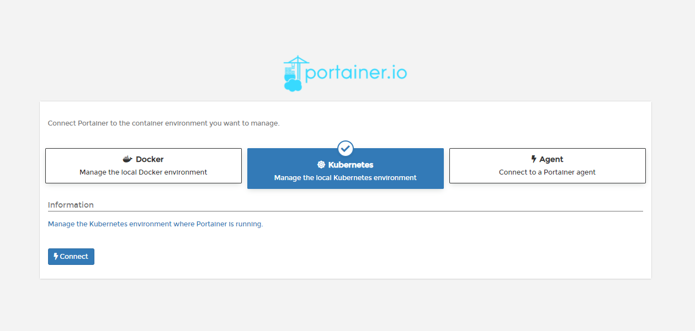
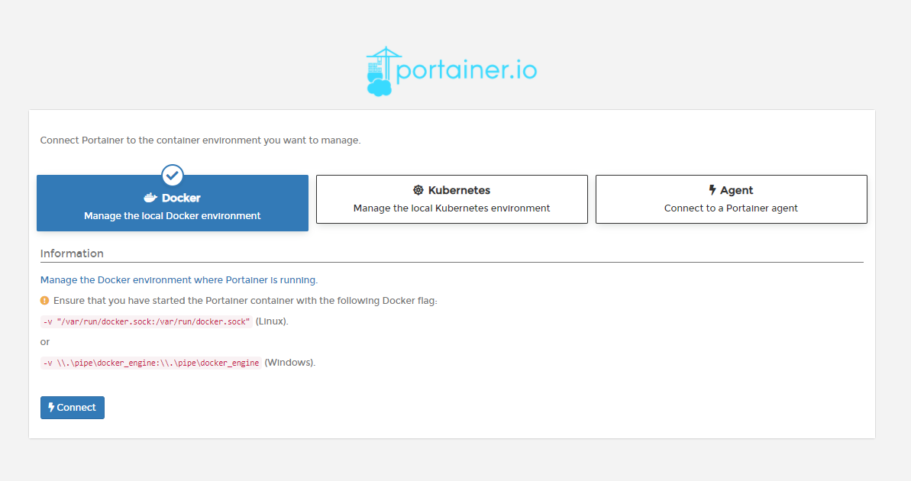
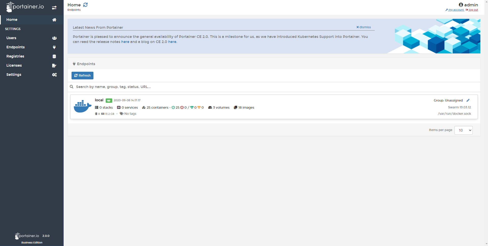

# Initial Setup

Once Portainer Server is deployed and you have navigated to the instance's URL, you are ready for the initial setup.

### Create the initial administrator user 

The first thing to do is create your first user, which will be an administrator. This password needs to be at least eight characters long. You can also change the username of the user if you prefer \(it defaults to `admin`\).

### Collection of Statistics

We anonymously collect information about how Portainer is used via a tool called Matomo. You can disable this option, but we recommend leaving it activated. This will help us understand how our users use Portainer and improve it.

You can find more information about what we do with your information in our privacy policy.

You can enable or disable connection statistics via the checkbox:

If you change your mind, this setting can be updated at a later date under Settings in the Portainer interface.

### Connect Portainer to the container environment

If you installed Portainer in Kubernetes you would choose Kubernetes, but if you installed in Docker, you may want choose manage the local Docker environment. Choose the option that makes sense for you. You will be able to add additional endpoints or change existing endpoints later through the Portainer interface.

Once you've selected the appropriate option, click **Connect**. If all goes well, you'll be logged into the Portainer interface.

### Next Steps

Congratulations, you've completed the Portainer setup! From here, your installation is ready to use. If you're brand new to Portainer, we recommend heading over to our guide on your first hour with Portainer.

